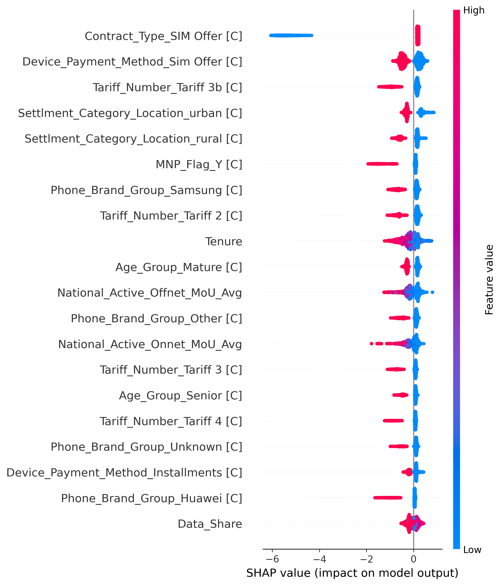

# Initialize
- create a virtual env
- install uv with `pip install uv`
- `uv pip install -r pyproject.toml --system` followed by `uv lock`

# Scripts
- `exploration.py` for processing, feature engineering and plots
- `modeling.py` for testing various models
    - after running `modeling.py`, in the terminal run `mlflow ui` to start the local mlflow server and look at metrics
- `register_model.py` for mlflow model registration
- `inference.py` for example usage

# Results

- 70% recall with XGBoost
- SHAP summary plot from the model:

